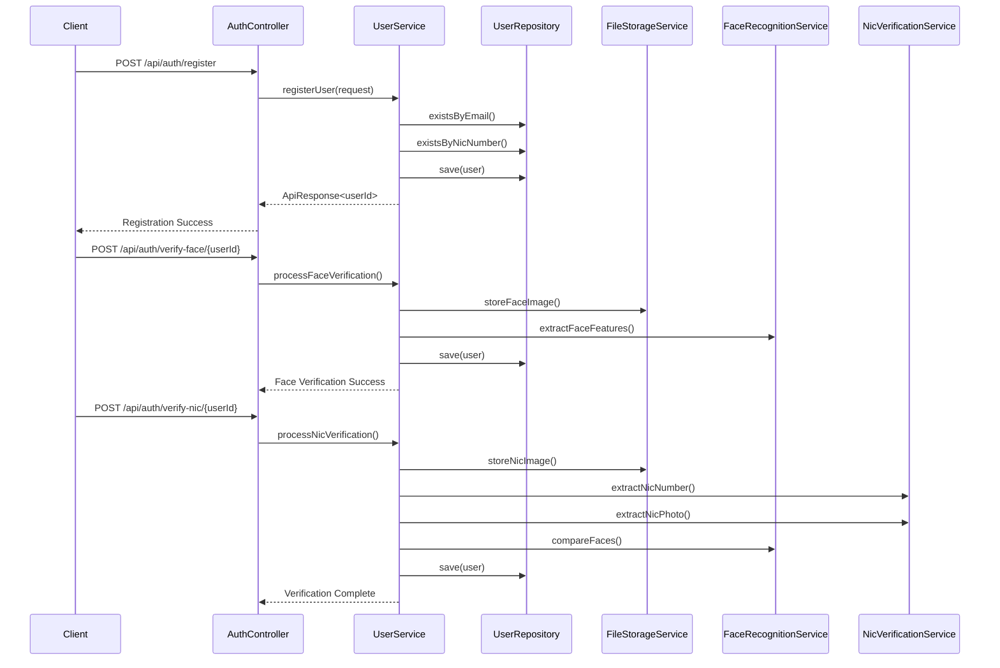
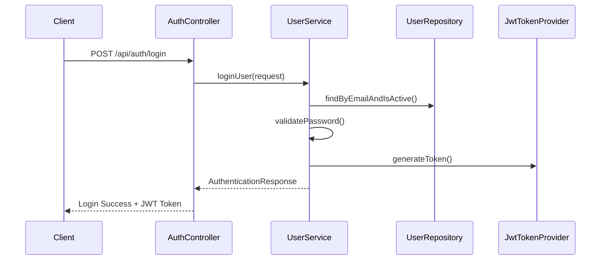

# GemNet Backend - Knowledge Base & Implementation Guide

## Table of Contents
1. [Project Architecture](#project-architecture)
2. [Implementation Flow](#implementation-flow)
3. [Technical Components](#technical-components)
4. [Security Implementation](#security-implementation)
5. [Face Recognition System](#face-recognition-system)
6. [NIC Verification System](#nic-verification-system)
7. [Database Design](#database-design)
8. [API Design Patterns](#api-design-patterns)
9. [Error Handling](#error-handling)
10. [Testing Strategy](#testing-strategy)
11. [Deployment Guidelines](#deployment-guidelines)
12. [Future Enhancements](#future-enhancements)

## Project Architecture

### MVC Architecture Implementation

The project follows the classic Model-View-Controller (MVC) pattern with Spring Boot:

```
┌─────────────────────────────────────────────────────────────┐
│                     CLIENT LAYER                            │
│  (Frontend Applications, Mobile Apps, API Consumers)        │
└─────────────────────┬───────────────────────────────────────┘
                      │
┌─────────────────────▼───────────────────────────────────────┐
│                 CONTROLLER LAYER                            │
│  • AuthController - Authentication endpoints                │
│  • Request/Response handling                               │
│  • Input validation                                        │
│  • Error handling                                          │
└─────────────────────┬───────────────────────────────────────┘
                      │
┌─────────────────────▼───────────────────────────────────────┐
│                  SERVICE LAYER                              │
│  • UserService - Business logic                           │
│  • FaceRecognitionService - Face processing               │
│  • NicVerificationService - OCR & NIC processing          │
│  • FileStorageService - File management                   │
└─────────────────────┬───────────────────────────────────────┘
                      │
┌─────────────────────▼───────────────────────────────────────┐
│                REPOSITORY LAYER                             │
│  • UserRepository - Data access                           │
│  • MongoDB integration                                     │
│  • Custom queries                                         │
└─────────────────────┬───────────────────────────────────────┘
                      │
┌─────────────────────▼───────────────────────────────────────┐
│                  DATA LAYER                                 │
│  • MongoDB Database                                        │
│  • File System Storage                                     │
└─────────────────────────────────────────────────────────────┘
```

### Core Components

#### 1. Controller Layer (`com.gemnet.controller`)
- **AuthController**: Handles all authentication-related endpoints
- Manages HTTP requests/responses
- Performs input validation using Bean Validation
- Integrates with Swagger for API documentation

#### 2. Service Layer (`com.gemnet.service`)
- **UserService**: Core business logic for user management
- **FaceRecognitionService**: OpenCV-based face detection and comparison
- **NicVerificationService**: OCR processing and NIC validation
- **FileStorageService**: Secure file upload and management

#### 3. Repository Layer (`com.gemnet.repository`)
- **UserRepository**: MongoDB data access layer
- Custom query methods for complex searches
- Built on Spring Data MongoDB

#### 4. Model Layer (`com.gemnet.model`)
- **User**: Main entity representing user data
- MongoDB document mapping
- Validation annotations

#### 5. DTO Layer (`com.gemnet.dto`)
- **Request DTOs**: UserRegistrationRequest, LoginRequest
- **Response DTOs**: AuthenticationResponse, ApiResponse
- Input validation and data transfer

## Implementation Flow

### User Registration Flow



### Login Flow



## Technical Components

### 1. Spring Boot Configuration

#### Application Properties Structure
```properties
# Server Configuration
server.port=8080
server.servlet.context-path=/

# MongoDB Configuration
spring.data.mongodb.host=localhost
spring.data.mongodb.port=27017
spring.data.mongodb.database=gemnet_db
spring.data.mongodb.auto-index-creation=true

# Security Configuration
app.jwt.secret=<256-bit-secret-key>
app.jwt.expiration=86400000

# File Upload Configuration
spring.servlet.multipart.enabled=true
spring.servlet.multipart.max-file-size=10MB
spring.servlet.multipart.max-request-size=10MB
```

#### Dependency Management (pom.xml highlights)
```xml
<!-- Core Spring Boot -->
<dependency>
    <groupId>org.springframework.boot</groupId>
    <artifactId>spring-boot-starter-web</artifactId>
</dependency>

<!-- MongoDB Integration -->
<dependency>
    <groupId>org.springframework.boot</groupId>
    <artifactId>spring-boot-starter-data-mongodb</artifactId>
</dependency>

<!-- Security & JWT -->
<dependency>
    <groupId>org.springframework.boot</groupId>
    <artifactId>spring-boot-starter-security</artifactId>
</dependency>
<dependency>
    <groupId>io.jsonwebtoken</groupId>
    <artifactId>jjwt-api</artifactId>
    <version>0.12.3</version>
</dependency>

<!-- Face Recognition -->
<dependency>
    <groupId>org.openpnp</groupId>
    <artifactId>opencv</artifactId>
    <version>4.6.0-0</version>
</dependency>

<!-- OCR -->
<dependency>
    <groupId>net.sourceforge.tess4j</groupId>
    <artifactId>tess4j</artifactId>
    <version>5.8.0</version>
</dependency>
```

### 2. MongoDB Integration

#### Document Structure
```javascript
// User Document Schema
{
  "_id": ObjectId("..."),
  "firstName": "John",
  "lastName": "Doe",
  "email": "john@example.com",          // Unique index
  "password": "$2a$10$...",              // BCrypt hashed
  "phoneNumber": "+94771234567",
  "address": "123 Main St, Colombo",
  "dateOfBirth": "1990-01-01",
  "nicNumber": "901234567V",             // Unique index
  
  // Face verification data
  "faceImagePath": "/uploads/face-images/user123_face_20241215_143022_a1b2c3d4.jpg",
  "faceFeatures": "base64EncodedFaceFeatures...",
  
  // NIC verification data
  "nicImagePath": "/uploads/nic-images/user123_nic_20241215_143045_e5f6g7h8.jpg",
  "extractedNicNumber": "901234567V",
  "extractedNicImagePath": "/uploads/extracted-photos/user123_extracted_20241215_143050_i9j0k1l2.jpg",
  
  // Verification status
  "isVerified": true,
  "isFaceVerified": true,
  "isNicVerified": true,
  "verificationStatus": "VERIFIED",      // PENDING, VERIFIED, REJECTED
  
  // Security
  "roles": ["USER"],
  "isActive": true,
  "isLocked": false,
  
  // Timestamps
  "createdAt": ISODate("2024-12-15T14:30:00Z"),
  "updatedAt": ISODate("2024-12-15T14:31:00Z")
}
```

#### Repository Methods
```java
public interface UserRepository extends MongoRepository<User, String> {
    // Basic queries
    Optional<User> findByEmail(String email);
    Optional<User> findByNicNumber(String nicNumber);
    
    // Existence checks
    boolean existsByEmail(String email);
    boolean existsByNicNumber(String nicNumber);
    
    // Verification queries
    List<User> findByVerificationStatus(String status);
    
    // Custom queries
    @Query("{'verificationStatus': 'PENDING', 'isActive': true}")
    List<User> findPendingVerificationUsers();
}
```

## Security Implementation

### JWT Token System

#### Token Generation
```java
public String generateToken(String email) {
    Date now = new Date();
    Date expiryDate = new Date(now.getTime() + jwtExpirationMs);
    
    return Jwts.builder()
            .setSubject(email)
            .setIssuedAt(now)
            .setExpiration(expiryDate)
            .signWith(secretKey, SignatureAlgorithm.HS512)
            .compact();
}
```

#### Security Filter Chain
```java
@Bean
public SecurityFilterChain filterChain(HttpSecurity http) throws Exception {
    http.cors().and().csrf().disable()
        .sessionManagement().sessionCreationPolicy(SessionCreationPolicy.STATELESS)
        .and()
        .authorizeHttpRequests(authz -> authz
            .requestMatchers("/api/auth/**").permitAll()
            .requestMatchers("/api/public/**").permitAll()
            .requestMatchers("/swagger-ui/**").permitAll()
            .anyRequest().authenticated()
        );
    
    http.addFilterBefore(jwtAuthenticationFilter, UsernamePasswordAuthenticationFilter.class);
    return http.build();
}
```

### Password Security
- BCrypt hashing with default strength (10 rounds)
- Password validation (minimum 8 characters)
- Account lockout mechanism ready for implementation

## Face Recognition System

### OpenCV Integration

#### Face Detection Algorithm
```java
public String extractFaceFeatures(MultipartFile imageFile) throws IOException {
    // Convert MultipartFile to Mat
    byte[] imageBytes = imageFile.getBytes();
    Mat image = Imgcodecs.imdecode(new MatOfByte(imageBytes), Imgcodecs.IMREAD_COLOR);
    
    // Convert to grayscale
    Mat grayImage = new Mat();
    Imgproc.cvtColor(image, grayImage, Imgproc.COLOR_BGR2GRAY);
    
    // Detect faces using Haar Cascade
    MatOfRect faces = new MatOfRect();
    faceDetector.detectMultiScale(grayImage, faces);
    
    // Extract and normalize face region
    Rect faceRect = faces.toArray()[0];
    Mat faceROI = new Mat(grayImage, faceRect);
    
    // Standardize size
    Mat resizedFace = new Mat();
    Size standardSize = new Size(100, 100);
    Imgproc.resize(faceROI, resizedFace, standardSize);
    
    // Convert to feature vector
    byte[] faceData = new byte[(int) (resizedFace.total() * resizedFace.elemSize())];
    resizedFace.get(0, 0, faceData);
    
    return Base64.getEncoder().encodeToString(faceData);
}
```

#### Face Comparison Algorithm
```java
public boolean compareFaces(String faceImagePath1, String faceImagePath2) {
    // Load and preprocess images
    Mat face1 = preprocessFaceImage(faceImagePath1);
    Mat face2 = preprocessFaceImage(faceImagePath2);
    
    // Template matching
    Mat result = new Mat();
    Imgproc.matchTemplate(face1, face2, result, Imgproc.TM_CCOEFF_NORMED);
    
    // Get similarity score
    Core.MinMaxLocResult mmr = Core.minMaxLoc(result);
    double similarity = mmr.maxVal;
    
    // Threshold-based decision
    double threshold = 0.6;
    return similarity > threshold;
}
```

### Face Recognition Features
- **Haar Cascade Classifier**: For initial face detection
- **Template Matching**: For face similarity comparison
- **Feature Extraction**: Convert face to standardized feature vector
- **Quality Validation**: Ensure face is detected before processing

### Limitations & Future Improvements
- Current implementation uses basic template matching
- Can be enhanced with deep learning models (FaceNet, ArcFace)
- Consider implementing liveness detection
- Add support for multiple face angles

## NIC Verification System

### OCR Implementation (Tesseract)

#### Text Extraction Process
```java
public String extractNicNumber(MultipartFile nicImage) throws IOException {
    // Convert to BufferedImage
    BufferedImage bufferedImage = ImageIO.read(nicImage.getInputStream());
    
    // Preprocess for better OCR
    BufferedImage preprocessedImage = preprocessImageForOCR(bufferedImage);
    
    // Perform OCR
    String ocrResult = tesseract.doOCR(preprocessedImage);
    
    // Extract NIC using regex
    return extractNicNumberFromText(ocrResult);
}
```

#### Image Preprocessing
```java
private BufferedImage preprocessImageForOCR(BufferedImage originalImage) {
    // Convert to OpenCV Mat
    Mat mat = bufferedImageToMat(originalImage);
    
    // Grayscale conversion
    Mat grayMat = new Mat();
    Imgproc.cvtColor(mat, grayMat, Imgproc.COLOR_BGR2GRAY);
    
    // Noise reduction
    Mat blurredMat = new Mat();
    Imgproc.GaussianBlur(grayMat, blurredMat, new Size(5, 5), 0);
    
    // Binarization
    Mat thresholdMat = new Mat();
    Imgproc.threshold(blurredMat, thresholdMat, 0, 255, 
                     Imgproc.THRESH_BINARY + Imgproc.THRESH_OTSU);
    
    return matToBufferedImage(thresholdMat);
}
```

#### NIC Number Pattern Recognition
```java
private String extractNicNumberFromText(String text) {
    String cleanText = text.replaceAll("\\s+", "").toUpperCase();
    
    // Old format: 9 digits + V (e.g., 123456789V)
    Pattern oldNicPattern = Pattern.compile("(\\d{9}V)");
    Matcher oldMatcher = oldNicPattern.matcher(cleanText);
    if (oldMatcher.find()) {
        return oldMatcher.group(1);
    }
    
    // New format: 12 digits (e.g., 199012345678)
    Pattern newNicPattern = Pattern.compile("(\\d{12})");
    Matcher newMatcher = newNicPattern.matcher(cleanText);
    if (newMatcher.find()) {
        return newMatcher.group(1);
    }
    
    return null;
}
```

### Photo Extraction from NIC

#### Region of Interest Detection
```java
private Mat extractPhotoRegionFromNic(Mat nicImage) {
    // For Sri Lankan NIC, photo is typically on the left side
    int imageWidth = nicImage.cols();
    int imageHeight = nicImage.rows();
    
    // Estimate photo region coordinates
    int photoX = (int) (imageWidth * 0.05);      // 5% from left
    int photoY = (int) (imageHeight * 0.2);      // 20% from top
    int photoWidth = (int) (imageWidth * 0.3);   // 30% of total width
    int photoHeight = (int) (imageHeight * 0.6); // 60% of total height
    
    // Extract region
    Rect photoRect = new Rect(photoX, photoY, photoWidth, photoHeight);
    return new Mat(nicImage, photoRect);
}
```

## Database Design

### Indexing Strategy

#### Primary Indexes
```javascript
// Unique indexes for fast lookups and constraint enforcement
db.users.createIndex({ "email": 1 }, { unique: true })
db.users.createIndex({ "nicNumber": 1 }, { unique: true })

// Compound indexes for common queries
db.users.createIndex({ "isActive": 1, "verificationStatus": 1 })
db.users.createIndex({ "email": 1, "isActive": 1 })

// Single field indexes for filtering
db.users.createIndex({ "verificationStatus": 1 })
db.users.createIndex({ "createdAt": 1 })
```

#### Query Optimization Examples
```javascript
// Efficient queries with proper indexing
db.users.find({ "email": "user@example.com", "isActive": true })
db.users.find({ "verificationStatus": "PENDING" }).sort({ "createdAt": 1 })
db.users.find({ "isActive": true, "verificationStatus": "VERIFIED" })
```

### Data Consistency

#### Verification Status Management
```java
public enum VerificationStatus {
    PENDING("User registration completed, verification pending"),
    VERIFIED("All verification steps completed successfully"),
    REJECTED("Verification failed - face or NIC mismatch");
}
```

#### Transaction Management
- MongoDB single-document operations are atomic
- Multi-document operations use transactions when needed
- Eventual consistency for non-critical operations

## API Design Patterns

### RESTful API Design

#### Resource Naming
```
POST   /api/auth/register          # Create user account
POST   /api/auth/verify-face/{id}  # Update user with face data
POST   /api/auth/verify-nic/{id}   # Update user with NIC data
POST   /api/auth/login             # Authenticate user
GET    /api/auth/health            # Health check
```

#### HTTP Status Codes
```java
// Success responses
200 OK          // Successful GET, PUT, DELETE
201 Created     // Successful POST (resource created)

// Client error responses
400 Bad Request    // Invalid input data
401 Unauthorized   // Authentication required
403 Forbidden      // Access denied
404 Not Found      // Resource not found
409 Conflict       // Resource already exists

// Server error responses
500 Internal Server Error  // Unexpected server error
```

### Response Standardization

#### ApiResponse Wrapper
```java
public class ApiResponse<T> {
    private boolean success;
    private String message;
    private T data;
    private LocalDateTime timestamp;
    
    // Static factory methods
    public static <T> ApiResponse<T> success(String message, T data) {
        return new ApiResponse<>(true, message, data);
    }
    
    public static <T> ApiResponse<T> error(String message) {
        return new ApiResponse<>(false, message);
    }
}
```

#### Consistent Response Format
```json
{
  "success": true,
  "message": "Operation completed successfully",
  "data": {
    "userId": "64a7b8c9d1e2f3a4b5c6d7e8",
    "email": "user@example.com"
  },
  "timestamp": "2024-12-15T14:30:00"
}
```

## Error Handling

### Exception Hierarchy

#### Custom Exceptions
```java
// Base exception class
public class GemNetException extends RuntimeException {
    public GemNetException(String message) {
        super(message);
    }
}

// Specific exceptions
public class UserAlreadyExistsException extends GemNetException { }
public class UserNotFoundException extends GemNetException { }
public class InvalidCredentialsException extends GemNetException { }
public class FaceVerificationException extends GemNetException { }
public class NicVerificationException extends GemNetException { }
```

### Global Exception Handler

#### Controller Advice
```java
@RestControllerAdvice
public class GlobalExceptionHandler {
    
    @ExceptionHandler(UserAlreadyExistsException.class)
    public ResponseEntity<ApiResponse<Object>> handleUserAlreadyExists(
            UserAlreadyExistsException e) {
        return ResponseEntity.status(HttpStatus.CONFLICT)
                .body(ApiResponse.error(e.getMessage()));
    }
    
    @ExceptionHandler(ValidationException.class)
    public ResponseEntity<ApiResponse<Object>> handleValidation(
            ValidationException e) {
        return ResponseEntity.status(HttpStatus.BAD_REQUEST)
                .body(ApiResponse.error("Validation failed: " + e.getMessage()));
    }
    
    @ExceptionHandler(Exception.class)
    public ResponseEntity<ApiResponse<Object>> handleGeneral(Exception e) {
        logger.error("Unexpected error", e);
        return ResponseEntity.status(HttpStatus.INTERNAL_SERVER_ERROR)
                .body(ApiResponse.error("An unexpected error occurred"));
    }
}
```

### Error Response Examples

#### Validation Error
```json
{
  "success": false,
  "message": "Validation failed: Email is required",
  "data": null,
  "timestamp": "2024-12-15T14:30:00"
}
```

#### Authentication Error
```json
{
  "success": false,
  "message": "Invalid email or password",
  "data": null,
  "timestamp": "2024-12-15T14:30:00"
}
```

## Testing Strategy

### Unit Testing

#### Service Layer Tests
```java
@ExtendWith(MockitoExtension.class)
class UserServiceTest {
    
    @Mock
    private UserRepository userRepository;
    
    @Mock
    private PasswordEncoder passwordEncoder;
    
    @InjectMocks
    private UserService userService;
    
    @Test
    void shouldRegisterNewUser() {
        // Given
        UserRegistrationRequest request = createValidRegistrationRequest();
        when(userRepository.existsByEmail(anyString())).thenReturn(false);
        when(userRepository.existsByNicNumber(anyString())).thenReturn(false);
        when(passwordEncoder.encode(anyString())).thenReturn("encoded-password");
        when(userRepository.save(any(User.class))).thenReturn(createUser());
        
        // When
        ApiResponse<String> response = userService.registerUser(request);
        
        // Then
        assertTrue(response.isSuccess());
        assertEquals("User registered successfully", response.getMessage());
        verify(userRepository).save(any(User.class));
    }
}
```

### Integration Testing

#### Controller Tests
```java
@SpringBootTest
@AutoConfigureTestDatabase(replace = AutoConfigureTestDatabase.Replace.NONE)
@TestPropertySource(locations = "classpath:application-test.properties")
class AuthControllerIntegrationTest {
    
    @Autowired
    private TestRestTemplate restTemplate;
    
    @Test
    void shouldRegisterUser() {
        // Given
        UserRegistrationRequest request = createValidRegistrationRequest();
        
        // When
        ResponseEntity<ApiResponse> response = restTemplate.postForEntity(
            "/api/auth/register", request, ApiResponse.class);
        
        // Then
        assertEquals(HttpStatus.OK, response.getStatusCode());
        assertTrue(response.getBody().isSuccess());
    }
}
```

### Test Data Management

#### Test Configuration
```properties
# application-test.properties
spring.data.mongodb.database=gemnet_test_db
spring.data.mongodb.host=localhost
spring.data.mongodb.port=27017

# JWT Configuration for testing
app.jwt.secret=testSecretKey
app.jwt.expiration=3600000

# File storage for testing
app.file-storage.base-path=./test-uploads
```

## Deployment Guidelines

### Environment-Specific Configurations

#### Development Environment
```properties
# application-dev.properties
server.port=8080
spring.data.mongodb.host=localhost
logging.level.com.gemnet=DEBUG
app.file-storage.base-path=./dev-uploads
```

#### Production Environment
```properties
# application-prod.properties
server.port=${PORT:8080}
spring.data.mongodb.uri=${MONGODB_URI}
logging.level.com.gemnet=INFO
app.file-storage.base-path=${FILE_STORAGE_PATH:/app/uploads}
app.jwt.secret=${JWT_SECRET}
```

### Docker Configuration

#### Dockerfile
```dockerfile
FROM openjdk:17-jdk-slim

# Install Tesseract OCR
RUN apt-get update && apt-get install -y \
    tesseract-ocr \
    tesseract-ocr-eng \
    && rm -rf /var/lib/apt/lists/*

# Copy application
COPY target/gemnet-backend-1.0.0.jar app.jar

# Create uploads directory
RUN mkdir -p /app/uploads

# Expose port
EXPOSE 8080

# Run application
ENTRYPOINT ["java", "-jar", "/app.jar"]
```

#### Docker Compose
```yaml
version: '3.8'
services:
  gemnet-backend:
    build: .
    ports:
      - "8080:8080"
    environment:
      - MONGODB_URI=mongodb://mongo:27017/gemnet_db
      - JWT_SECRET=${JWT_SECRET}
    depends_on:
      - mongo
    volumes:
      - uploads-data:/app/uploads

  mongo:
    image: mongo:4.4
    ports:
      - "27017:27017"
    volumes:
      - mongo-data:/data/db

volumes:
  mongo-data:
  uploads-data:
```

### Production Deployment Checklist

#### Security
- [ ] Update JWT secret to strong random key
- [ ] Enable HTTPS with SSL certificates
- [ ] Configure CORS for production frontend URLs
- [ ] Set up rate limiting
- [ ] Enable security headers

#### Performance
- [ ] Configure connection pooling
- [ ] Set up caching where appropriate
- [ ] Optimize database indexes
- [ ] Configure JVM heap settings
- [ ] Set up monitoring and metrics

#### Reliability
- [ ] Set up health checks
- [ ] Configure logging aggregation
- [ ] Set up backup strategies
- [ ] Configure graceful shutdown
- [ ] Set up disaster recovery

## Future Enhancements

### Short-term Improvements (Next 3 months)

#### Enhanced Face Recognition
```java
// Integration with advanced face recognition models
public class AdvancedFaceRecognitionService {
    // Implement FaceNet or ArcFace models
    // Add liveness detection
    // Support multiple face angles
    // Improve accuracy with deep learning
}
```

#### Advanced NIC Processing
```java
// Better OCR and image processing
public class EnhancedNicVerificationService {
    // Template matching for different NIC formats
    // Better photo extraction algorithms
    // Support for damaged or poor quality NICs
    // Confidence scoring for OCR results
}
```

### Medium-term Enhancements (3-6 months)

#### Multi-factor Authentication
- SMS/Email OTP integration
- Biometric authentication options
- Hardware security key support

#### Admin Dashboard
- User management interface
- Verification review system
- Analytics and reporting
- Bulk operations support

#### API Enhancements
- GraphQL support
- Webhook notifications
- Batch processing APIs
- Advanced search capabilities

### Long-term Vision (6+ months)

#### Machine Learning Integration
- Fraud detection algorithms
- Behavioral analysis
- Risk scoring
- Automated decision making

#### Scalability Improvements
- Microservices architecture
- Event-driven design
- Distributed file storage
- Message queue integration

#### Advanced Security
- Zero-trust security model
- Advanced threat detection
- Compliance frameworks (GDPR, etc.)
- Privacy-preserving technologies

## Performance Considerations

### Database Optimization

#### Query Performance
```javascript
// Efficient query patterns
db.users.find(
  { "email": "user@example.com", "isActive": true },
  { "password": 0, "faceFeatures": 0 }  // Exclude large fields
).hint({ "email": 1, "isActive": 1 })

// Aggregation for complex operations
db.users.aggregate([
  { $match: { "verificationStatus": "PENDING" } },
  { $group: { _id: "$verificationStatus", count: { $sum: 1 } } }
])
```

#### Connection Management
```java
// MongoDB connection configuration
@Configuration
public class MongoConfig {
    @Bean
    public MongoClientSettings mongoClientSettings() {
        return MongoClientSettings.builder()
                .applyToConnectionPoolSettings(builder -> 
                    builder.maxSize(100)
                           .minSize(5)
                           .maxWaitTime(30, TimeUnit.SECONDS))
                .build();
    }
}
```

### File Storage Optimization

#### Storage Strategy
```java
// Efficient file organization
uploads/
├── face-images/
│   ├── 2024/
│   │   ├── 12/
│   │   │   ├── 15/
│   │   │   │   └── user123_face_20241215_143022.jpg
├── nic-images/
└── extracted-photos/
```

#### File Cleanup Strategy
```java
@Scheduled(cron = "0 0 2 * * ?") // Daily at 2 AM
public void cleanupOldFiles() {
    // Remove files older than retention period
    // Clean up failed verification attempts
    // Optimize storage usage
}
```

## Monitoring and Observability

### Logging Strategy

#### Structured Logging
```java
@Service
public class UserService {
    private static final Logger logger = LoggerFactory.getLogger(UserService.class);
    
    public ApiResponse<String> registerUser(UserRegistrationRequest request) {
        logger.info("User registration attempt for email: {}", request.getEmail());
        
        try {
            // Registration logic
            logger.info("User registered successfully: {}", savedUser.getId());
            return ApiResponse.success("Registration successful", savedUser.getId());
        } catch (Exception e) {
            logger.error("Registration failed for email: {}", request.getEmail(), e);
            return ApiResponse.error("Registration failed");
        }
    }
}
```

#### Log Levels
```properties
# Production logging configuration
logging.level.com.gemnet=INFO
logging.level.com.gemnet.security=WARN
logging.level.org.springframework.security=WARN
logging.level.org.mongodb=WARN

# Development logging
logging.level.com.gemnet=DEBUG
logging.level.org.springframework.web=DEBUG
```

### Health Checks

#### Custom Health Indicators
```java
@Component
public class DatabaseHealthIndicator implements HealthIndicator {
    @Autowired
    private UserRepository userRepository;
    
    @Override
    public Health health() {
        try {
            long userCount = userRepository.count();
            return Health.up()
                    .withDetail("users", userCount)
                    .withDetail("status", "Database is accessible")
                    .build();
        } catch (Exception e) {
            return Health.down()
                    .withDetail("error", e.getMessage())
                    .build();
        }
    }
}
```

This knowledge base provides comprehensive understanding of the GemNet backend implementation, serving as a reference for future development, maintenance, and enhancement of the system. The modular architecture and well-documented components make it easy to extend functionality and adapt to changing requirements.
